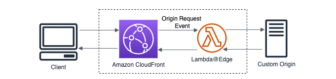

# Resizing Images with Lambda@Edge using the Custom Origin

You can the images and convert the image format by query parameters.
This Lambda@Edge sample code using the custom origin as the original image source.

## Architecture



The Lambda@Edge function gets invoked only when there's a cache-miss.
1. Derive the custom origin name from the origin defined for the CloudFront distribution.
2. Parse the image width and format needed from the querystring.
3. Using the request URI fetch the original image into buffer using the Node.js HTTP module.
4. Apply the resize transformation using the open source Sharp module packaged with the Lambda function.
5. Send a binary response of the resized image with appropriate status code and headers for content type and cache control headers.

## Prerequisites
* [Custom Origin](https://docs.aws.amazon.com/AmazonCloudFront/latest/DeveloperGuide/DownloadDistS3AndCustomOrigins.html#concept_CustomOrigin) : You need to have your custom origin with HTTPS port 443 enabled as the image source. (Retrieve the original image from your custom origin via HTTPS port 443). You will use the origin server name (Origin domain) as a parameter to CDK deploy.

* [AWS Cloud Development Kit (AWS CDK)](https://docs.aws.amazon.com/cdk/v2/guide/getting_started.html): You will deploy the project using AWS CDK.

## Deployment

switch to nodejs v20
```
nvm use 20
```
Install dependencies
```
npm install
```
Install [Sharp](https://sharp.pixelplumbing.com/) for Lambda@Edge
```
npm run build
```
Go back to the root and run bootstrap the AWS CDK
```
npx cdk bootstrap --region ap-southeast-1 -c originName=[your_bucket_name].s3.ap-southeast-1.amazonaws.com
```
Deploy the stack
```
npx cdk deploy ImageResizeStack[Prod|Staging] -c originName=[your_bucket_name].s3.ap-southeast-1.amazonaws.com
```
You can find the new CloudFront distribution once the deployment is successful. Please check the distribution settings and access the URL with the parameters below.

## Query Parameters
Resize and convert JPEG (*.jpg) images based on the query string parameters:
* width: pixels (auto-scale the height to match the width)
* height: pixels (optional)
* format: jpg or webp (optional default jpg)

Example 1: Change width to pixel 240 while a format keeps jpeg format
(need format parameter even though no format changes)

`https://dxxxxx.cloudfront.net/image/test.jpg?width=240&format=jpg`

Example 2: Change width to pixel 360 and convert to webp format

`https://dxxxxx.cloudfront.net/image/test.jpg?width=360&format=webp`

## Cleanup
You will need to [manually delete the Lamnbda@Edge function](https://docs.aws.amazon.com/AmazonCloudFront/latest/DeveloperGuide/lambda-edge-delete-replicas.html) (ImageResizeStack[Prod|Staging]) then remove the stack with:

1. Go to Cloudfront distribution
2. Select a distribution
3. Select behavior
4. Disassociate edge function from Cloudfront
5. Execute this command
```
npx cdk destroy ImageResizeStack[Prod|Staging] -c originName=[your_bucket_name].s3.ap-southeast-1.amazonaws.com
```